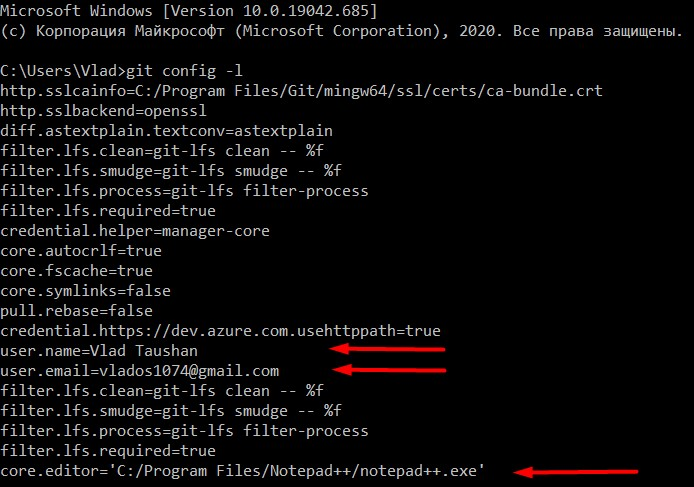
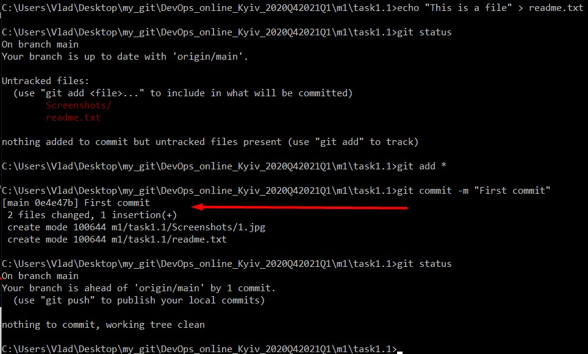
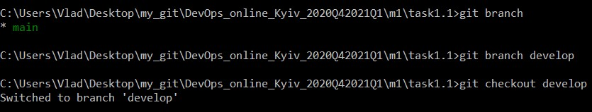
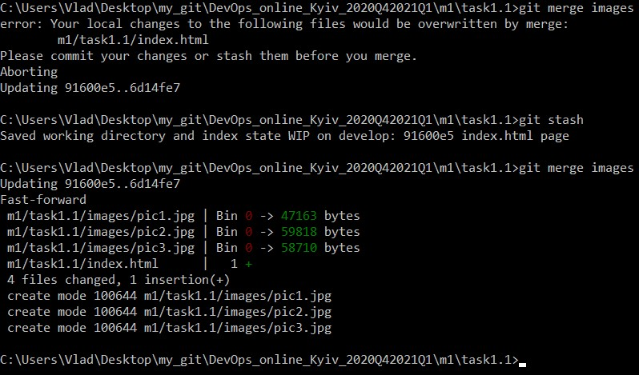
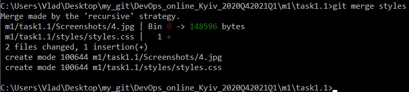
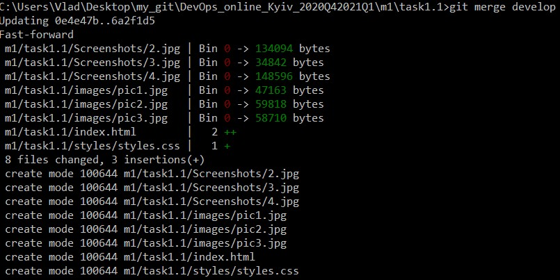
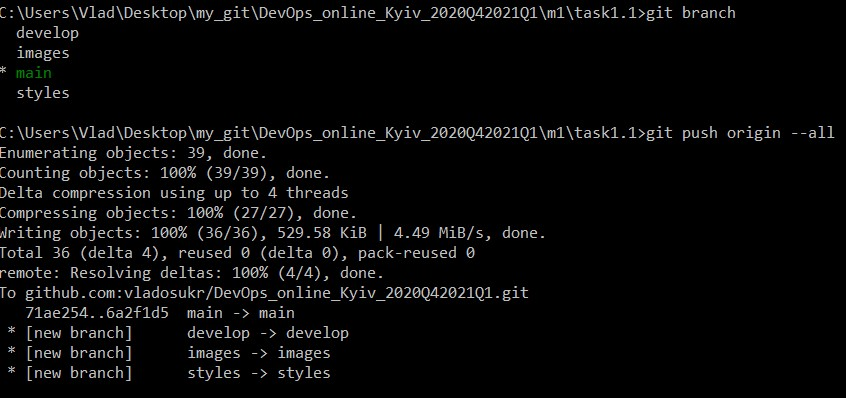

# Steps of Task1.1 execution
## After having installed and created GitHub account, I've added my global configs.

## Once the file was created and approved for the stage by using an *add* command, it can be commited with the command *commit*

## Moving on, there is a time for our first branch to come to life with the command *branch + name*

## Since our 3 branches **develop**, **images** and **styles** have been successfully created, we can merge them one by one.
## Should you have any conflict, try to resolve it with the command *stash*. The command saves your local modifications away and reverts the working directory to match the HEAD commit.

## Now it's high time to merge our **develop** branch to the ** master** branch

## To observe and analyze more details, try the *log* command with different options

## Finally use *push origin* and here you go!

 
#DevOps. My view.
## This specialization is all abount permanent challenges and self-developing.
## Yoh have to combine the knowledge of underlying infrastructure, code, testing, deploying and an endless row of automatisation and deployment tools.
## However, this challenge is amazing and makes this IT role absorbing and captivating.
## But the most fascinating thing about DevOps is that everything is moving to the Cloud which evolves and in this way facilitates and speeds up your performance.
