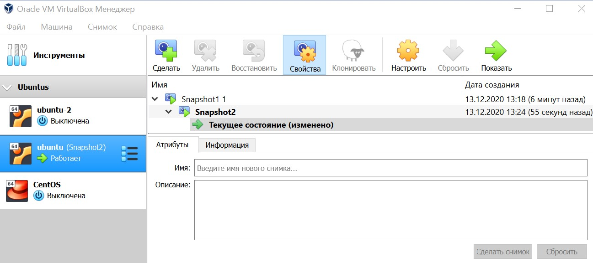
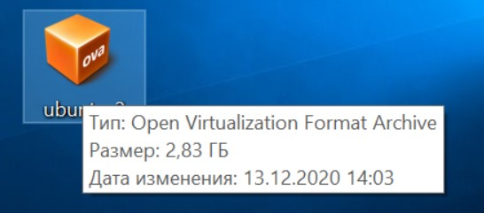
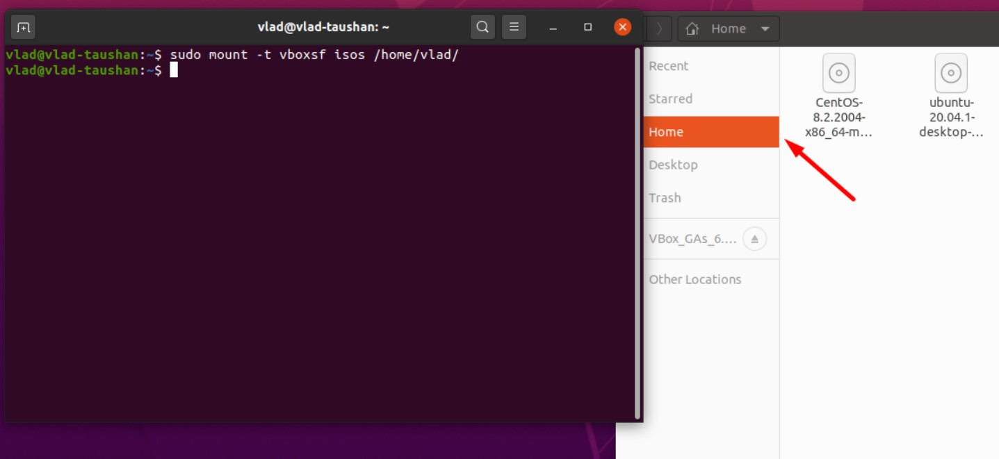
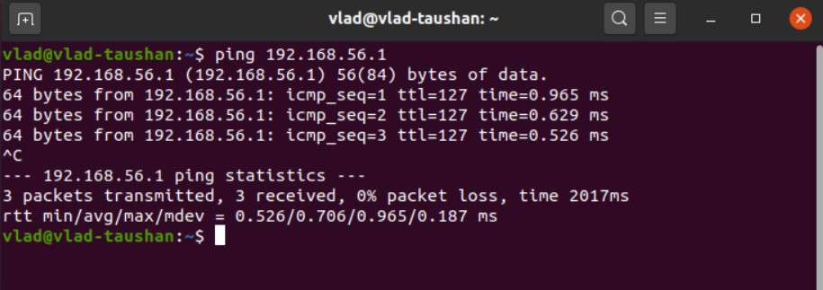
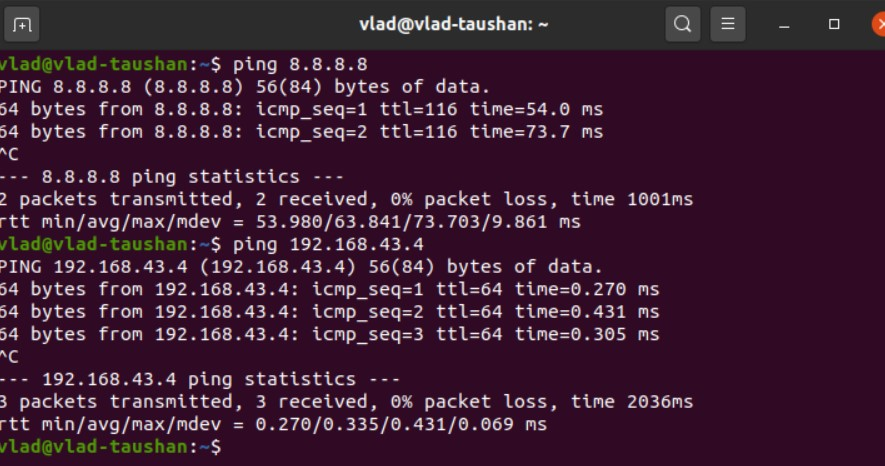
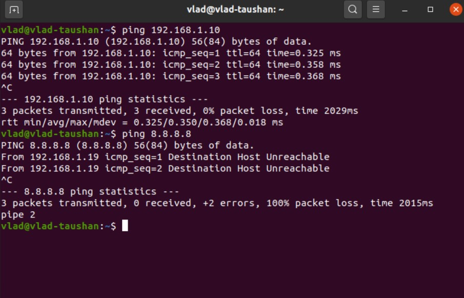
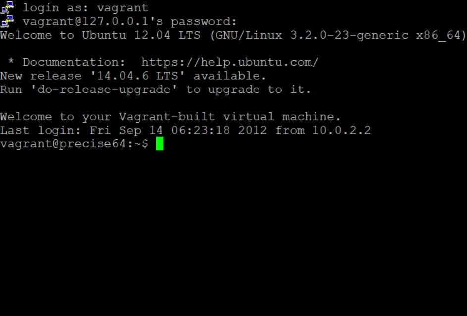

# PART 1. HYPERVISORS
* What are the most popular hypervisors for infrastructure virtualization?
*VMware vSphere, Microsoft Hyper-V, Oracle VM VirtualBox*
* Briefly describe the main differences of the most popular hypervisors.
*Bare metal or native vs hosted hypervisors. Type 1 runs directly on the hardware with Virtual Machine resources provided. Type 2 runs on the host OS to provide virtualization management and other services.*

# Steps of Task2.1 execution.

Having successfully installed the VirtualBox program, I created 2 VMs (Ubuntu).
The second machine was created by cloning procedure. Then both VMs were added to a single group.
Then I tried the snapshot feature.

The next step was to try export and import functionality (.ova files)

Having explored the most common features like general settings, system settings, display, storage, audio, network and configured the USB ports, I mounted the **shared folder**.

Then I configured the connections of different network modes like: Host-only, Internal, Bridged, NAT, NATservice. Kindly see some examples of pinging below.

If we analyze a bridged connection, for instance, the table will show the following:

Mode | #Ubuntu>Host | #Ubuntu<Host | #Ubuntu<> Ubuntu2 | #Ubuntu>Net | #Ubuntu<Net
--- | --- | --- | --- |--- |---
Bridged | + | + | + | + | +

Finally, I tried some commands of VBoxManage

The third part of the task was exploring of **VAGRANT**
Once successfully installed,

I executed the *date* command as an example of proper working

Then I downloaded the minimal version of CentOS distributive and made a Vagrant box, based on it.

