# Steps of Task2.2 execution.

Please find below the printscreens of successfully launched AWS services.

* Lightsail.

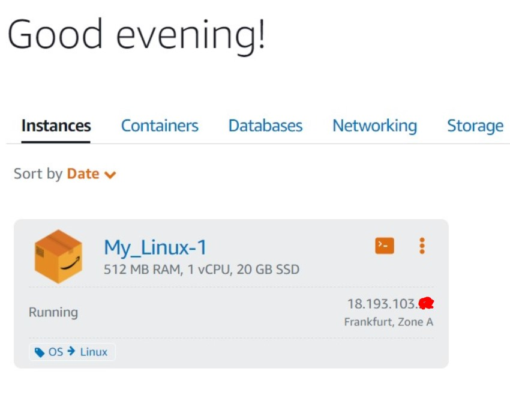

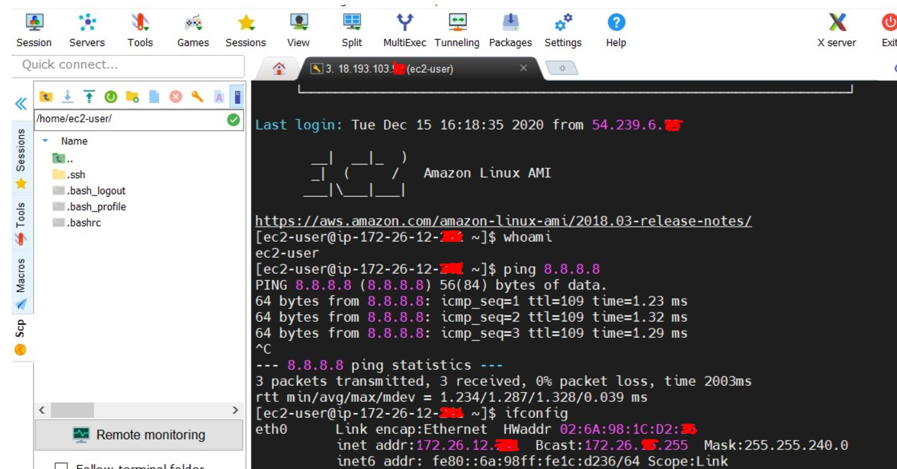

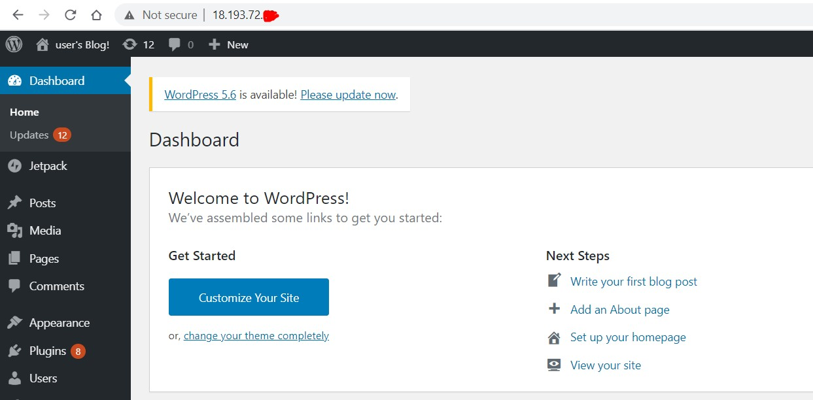

* EC2

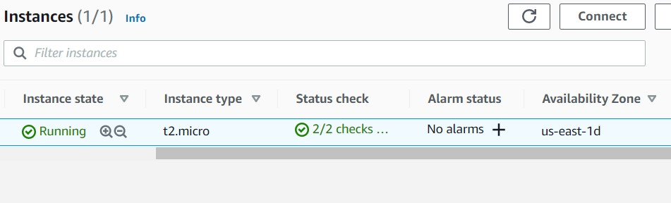

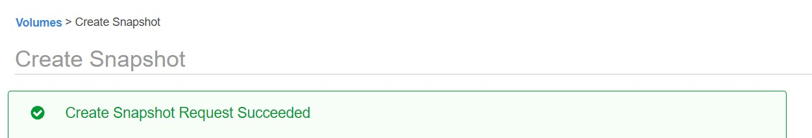

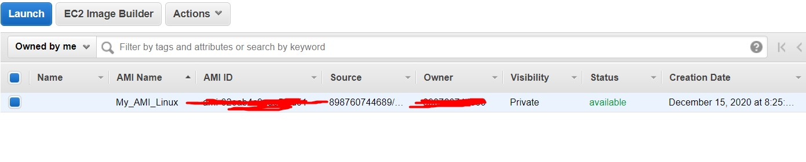

* EBS

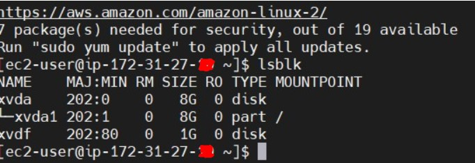

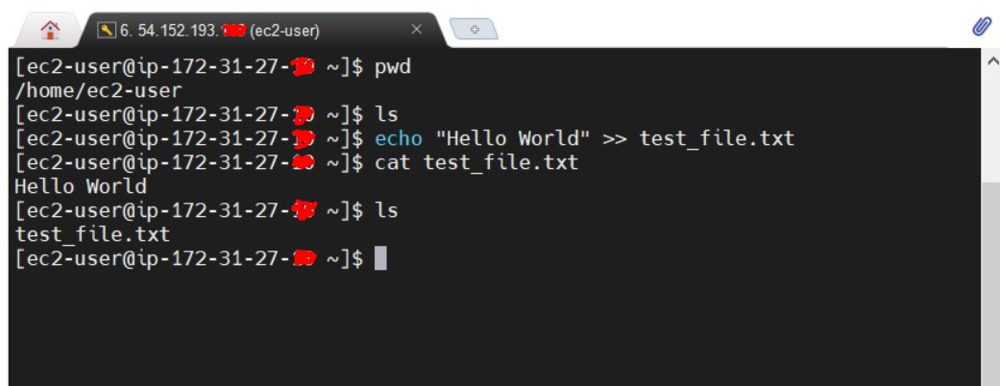

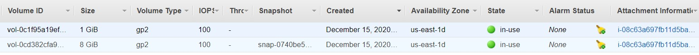

* S3

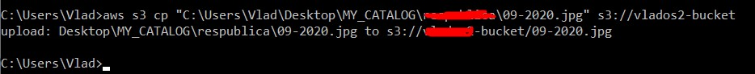

* ECS

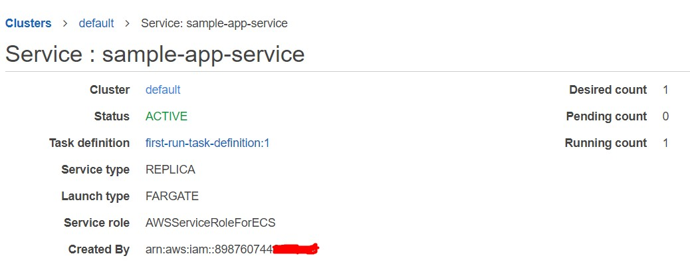

* Static website via S3

http://my-site2020.s3-website.eu-central-1.amazonaws.com/

