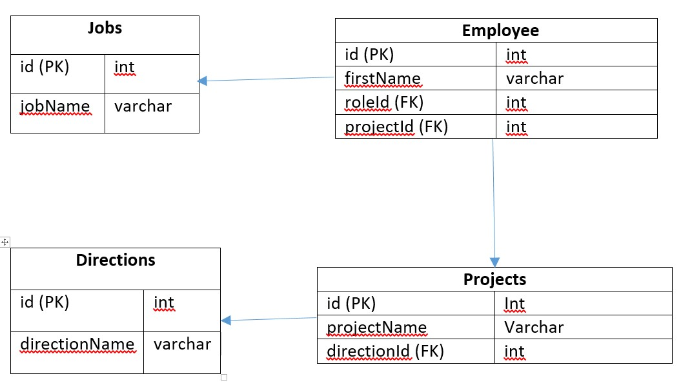
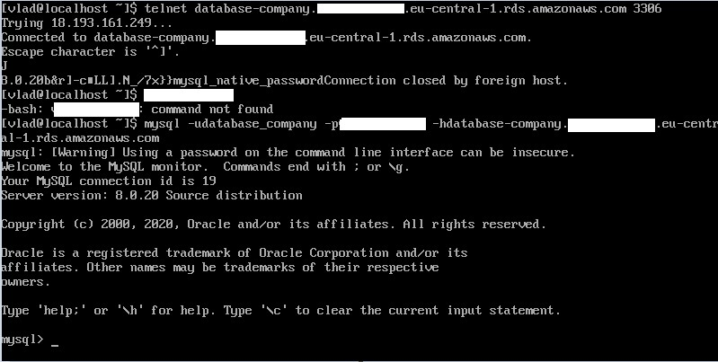
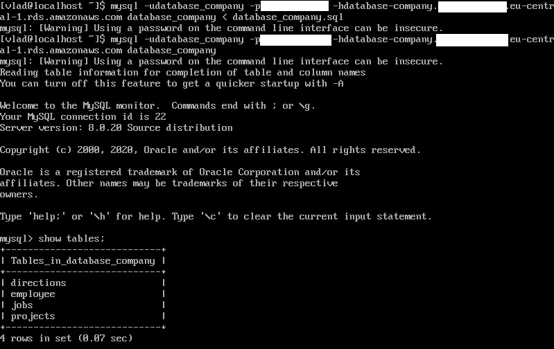
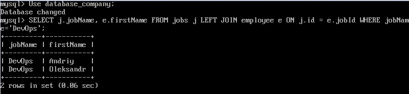
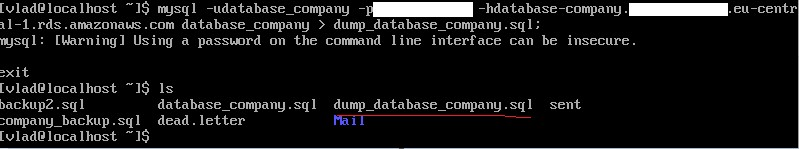
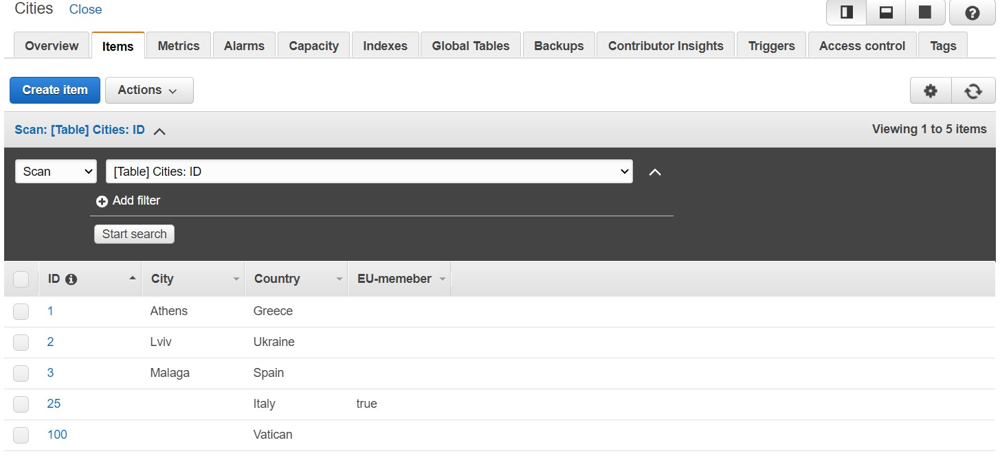

# Steps of Task2.2 execution.

Once the MySQL server was installed on CentOS8 VM, I have configured my database.
Please see the schema below.

Here are the SQL commands to form the described above database.

*Create database company;*

*USE company;*
*CREATE TABLE jobs (id INT AUTO_INCREMENT PRIMARY KEY,*
*jobName VARCHAR(30));*

*USE company;*
*CREATE TABLE directions (id INT AUTO_INCREMENT PRIMARY KEY,*
*directionName VARCHAR(30));*

*USE company;*
*CREATE TABLE projects*
*(id INT NOT NULL  AUTO_INCREMENT,*
*projectName VARCHAR(30),*
*directionId INT,*
*PRIMARY KEY (id),*
*FOREIGN KEY (directionId) REFERENCES directions(id));*

*USE company;*
*CREATE TABLE employee*
*(id INT NOT NULL  AUTO_INCREMENT,*
*firstName VARCHAR(30),*
*jobId INT,*
*projectId INT,*
*PRIMARY KEY (id),*
*FOREIGN KEY (jobId) REFERENCES jobs(id),*
*FOREIGN KEY (projectId) REFERENCES projects(id));*

*USE company;*
*INSERT INTO jobs (jobName) VALUES ('Developer');*
*INSERT INTO jobs (jobName) VALUES ('DevOps');*
*INSERT INTO jobs (jobName) VALUES ('QA');*

*USE company;*
*INSERT INTO directions (directionName) VALUES ('Java');*
*INSERT INTO directions (directionName) VALUES ('Python');*
*INSERT INTO directions (directionName) VALUES ('Go');*

*USE company;*
*INSERT INTO projects (projectName, directionId) VALUES ('Site', 1);*
*INSERT INTO projects (projectName, directionId) VALUES ('Application', 1);*
*INSERT INTO projects (projectName, directionId) VALUES ('Database', 2);*

*USE company;*
*INSERT INTO employee (firstName, jobId, projectId) VALUES ('Ivan', 1, 1);*
*INSERT INTO employee (firstName, jobId, projectId) VALUES ('Petro', 1, 2);*
*INSERT INTO employee (firstName, jobId, projectId) VALUES ('Stepan', 1, 3);*
*INSERT INTO employee (firstName, jobId, projectId) VALUES ('Andriy',2, 1);*
*INSERT INTO employee (firstName, jobId, projectId) VALUES ('Oleksandr', 2, 3);*
*INSERT INTO employee (firstName, jobId, projectId) VALUES ('Iryna', 1, 1);*
*INSERT INTO employee (firstName, jobId, projectId) VALUES ('Anna', 3, 1);*
*INSERT INTO employee (firstName, jobId, projectId) VALUES ('Olga', 3, 2);*
*INSERT INTO employee (firstName, jobId, projectId) VALUES ('Maria', 3, 3);*

Bellow some queries DDL, DML, DCL are listed.

*USE company;*
*SELECT jobName FROM jobs;*

*USE company;*
*SELECT directionName FROM directions;*

*USE company;*
*SELECT projectName FROM projects;*

*USE company;*
*SELECT firstName FROM employee;*

*USE company;*
*SELECT  j.jobName,*
*e.firstName FROM jobs j*
*LEFT JOIN employee e ON j.id = e.jobId*
*WHERE jobName='Developer';*

*USE company;*
*SELECT  j.jobName,*
*e.firstName FROM jobs j*
*LEFT JOIN employee e ON j.id = e.jobId*
*WHERE jobName='DevOps';*

*USE company;*
*SELECT  d.directionName,*
*p.projectName FROM directions d*
*LEFT JOIN projects p ON d.id = p.directionId*
*WHERE directionName='Java';*

*USE company;*
*SELECT  jobs.jobName, employee.firstName, directions.directionName FROM jobs*
*INNER JOIN employee ON jobs.id = employee.jobId*
*INNER JOIN projects ON employee.projectId = projects.id*
*INNER JOIN directions ON projects.directionId = directions.id*
*WHERE directionName='Java' AND jobName='Developer';*

*SELECT COUNT(Id), jobId *
*FROM Employee*
*GROUP BY jobId*
*ORDER BY COUNT(Id) DESC;*

Next I tried to create some new users with different privileges.
Depending on privileges, they were allowed or not to do manipulations over the database.

*CREATE USER 'test'@'localhost' IDENTIFIED BY 'mypassword';*
*GRANT SELECT ON company.* TO 'test'@'localhost';*

The following step is to backup our database. Then delete some part and at last restore.
*mysqldump -u [username] –p [database_name] > [dump_file.sql]*

*USE company;*
*DELETE FROM employee WHERE firstName='Ivan';*

*mysql -u [username] –p[password] [database_name] < [dump_file.sql]*

Now it's high time to migrate our Database to AWS RDS.
Please see the screenshots below.

Doing some manipilations over the database.

Finally creating a dump.

The last but not the least part of the task is DynamoDB.

The query search is based on Primary Key.

While the scan search performs scanning of all database.

