# Steps of Task4.1 execution.

I installed Packet Tracer 4.11 by Cisco.
Then I launched one hub and 4 computers which were united into one network.
All the computers were assigned IP addresses starting from 192.168.0.1 to 192.168.0.4 respectively.
The mask for all of them was 255.255.255.0.
Please see the first screenshot.

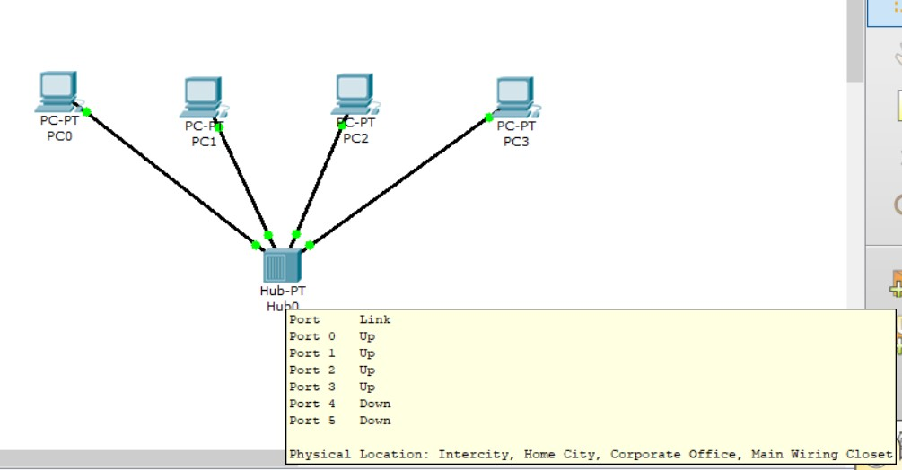

The next step was sending of ICMP packets from one host to another using ADD SIMPLE PDU.

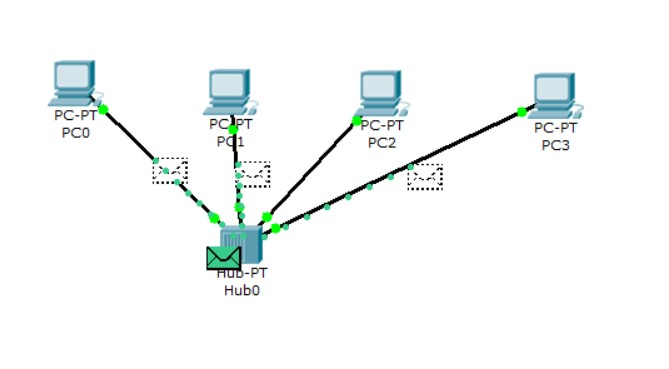

One of the hub's features is sending out the packets to all hosts, while only the recepient accepts and the rest refuse.

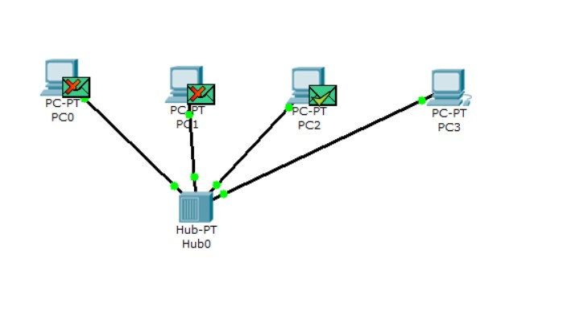

The packet was sent from Host PC2 to Host PC3. All the hosts were offered to accept packets, however, only PC2 or PC3 were able to accept them at a time.

In other words, the communication between PC2 and PC3 was performed with the usage of 3 layers of OSI model.
In the meantime, PC0 and PC1 communicated only at 1st and 2nd OSI level.

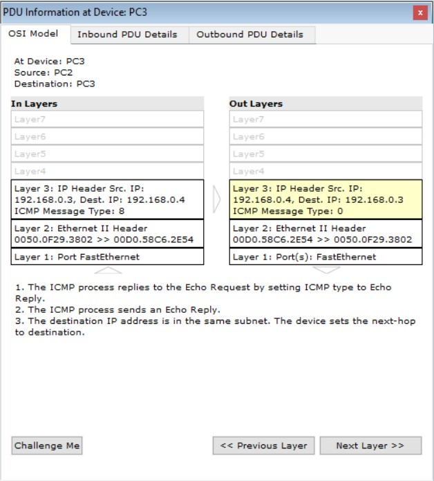

When the IPs were withdrawed, the process of transmitting wasn't able even to start.

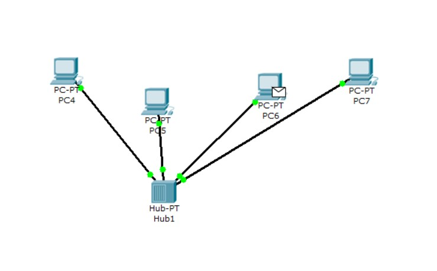

The next topology included: 5 PCs, 1 server and 2 hubs to connect 2 segments.

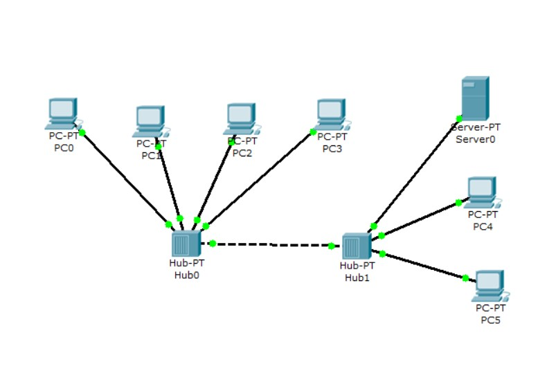

To check the in-service state, I just pinged a server and PC6 from PC2 in another segment.

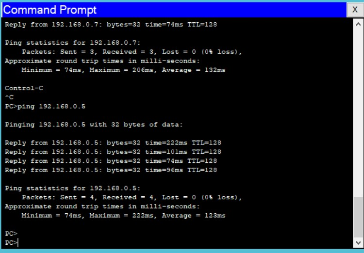

The next topology included: 4 PCs connected with a switch. Please see below the same steps with ICMP packets as they were shown for a hub configuration.

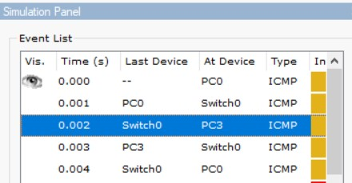

The main difference is that the switch sends the packets only to the addressee intended. The other PCs stand off this communication.

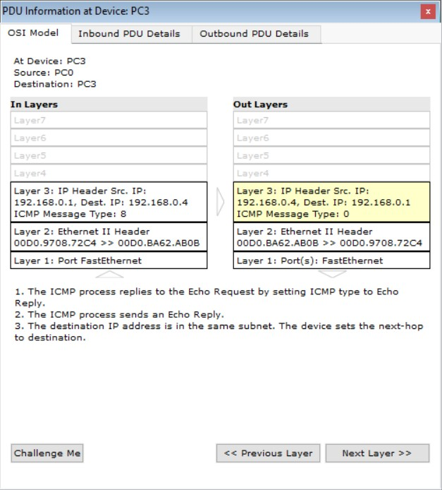

Then the schema was transferred to 2 segments of 4 PCS connected with 2 switches.

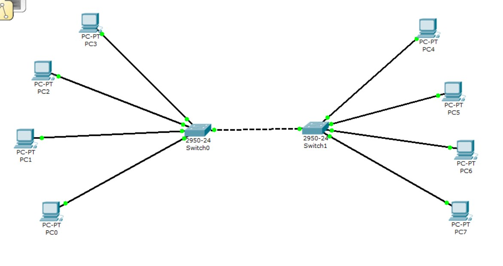

An in-service state was approved by successful pinging between 2 PCs of 2 segments

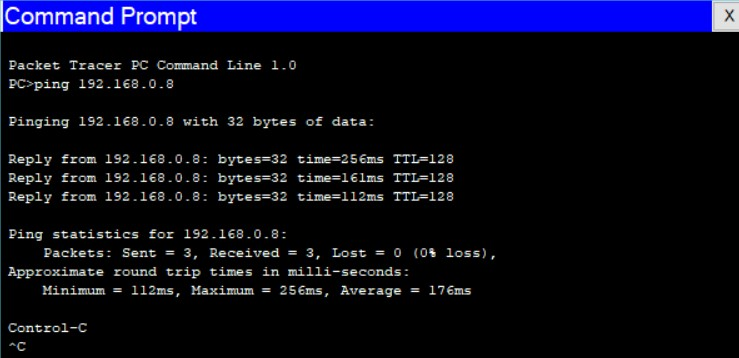

To configure two subnetworks, the router was added to be put between 2 switches.

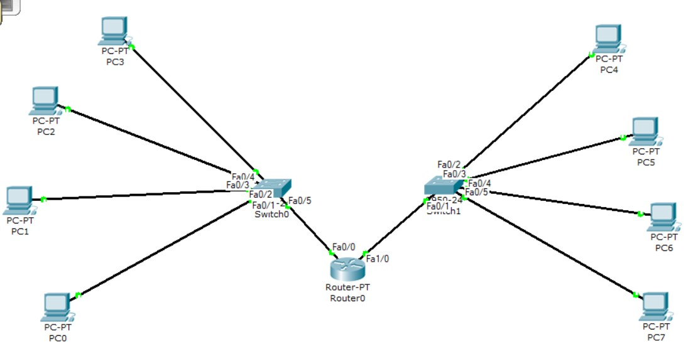

Then each PC was assigned with an IP address of the Gateway, i.e. router's port IP address.
To be sure the network operates properly, I pinged 2 PCs from different subnetworks (192.168.0.1 - 192.168.1.1)

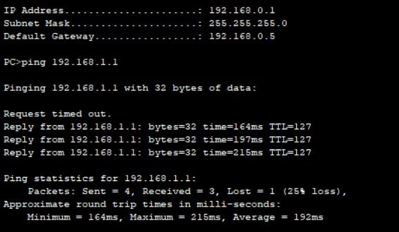

The router differs from the switch  because it is a more complex device which operates on the 3rs OSI model level.
It can filter the packets and will throw it away if there is no data for the recipient.
The router can combine different networks. Not only with local networks (as the switch does), but also with the global network.
The switch monitors the packet to learn the MAC address, while the router searches for an IP address.
