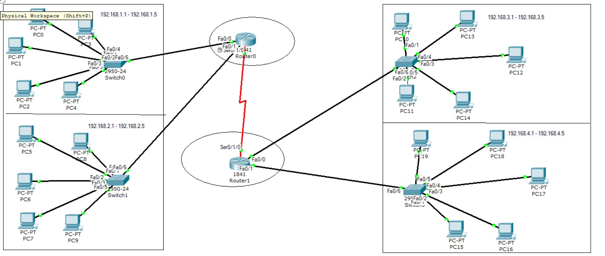
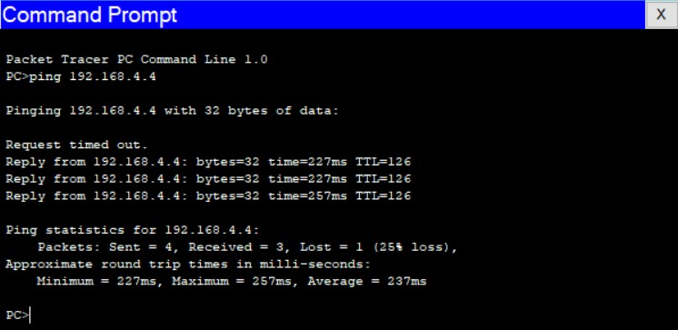
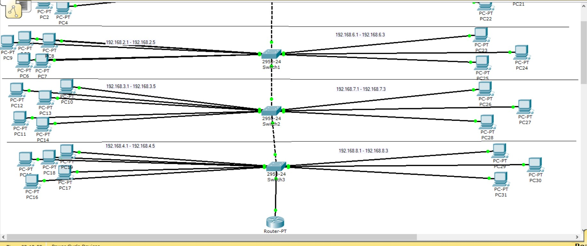
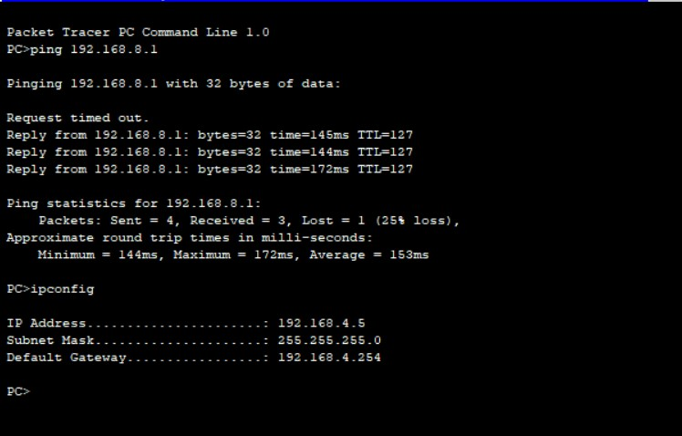
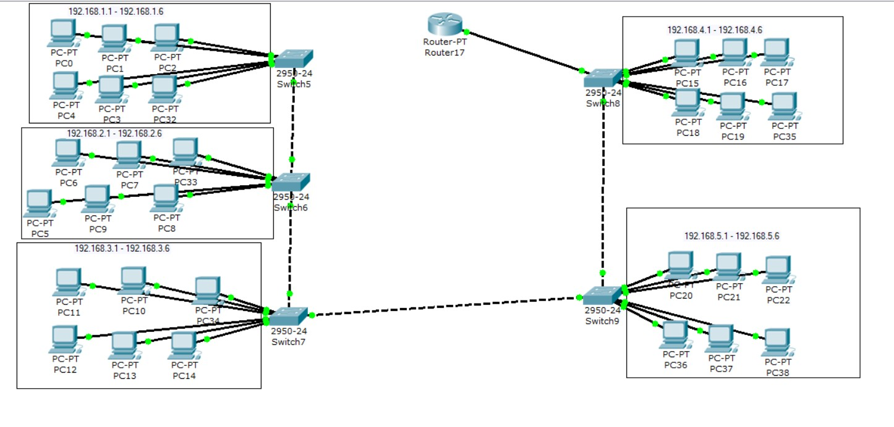

# Steps of Task4.2 execution.

1. The task is to create a corporate network, consisting of 2 two-level buildings.
All in all it should have 4 subnetworks connected among them.
Kindly see the schema reproduced below.

Each building has its own router where it unites 2 subnetworks.
Therefore, 2 routers need to communicate correclty with each other to have an inter-connection.
The traffic inside one subnetwork has little latency, while, sure thing, that the traffic between the subnetworks of buildings is slower.
To set an inter-connection, an *ip route* command was used.
Below you can see a ping from one building's subnetwork to another's one.

The network operates properly.

2. The task is to create a corporate network in a four-level building.
Each level includes 2 workgroups, consisting of 3 and 5 computers respectively.

I created 8 vlans(4 vlans with 5 computers and 4 vlans with 3 computers), starting with the range 192.168.1.1 - 192.168.1.5 and ending with 192.168.8.1 - 192.168.8.3
Firstly, each vlan was connected to a switch. Then the switches were connected among them in a trunk mode.
Finally, the switches were connected to a router, while the router configures with necessary vlans' default gateways.
It worked. And every PC in the network could communicate with each other.
Please the below the screenshot, where a computer from the 8th vlan is successfully pinged by a computer in the 4th vlan.

3. The third task was similar to the previous one.
However, here there were 5 buildings divided into 5 vlans, with 6 computers either.

