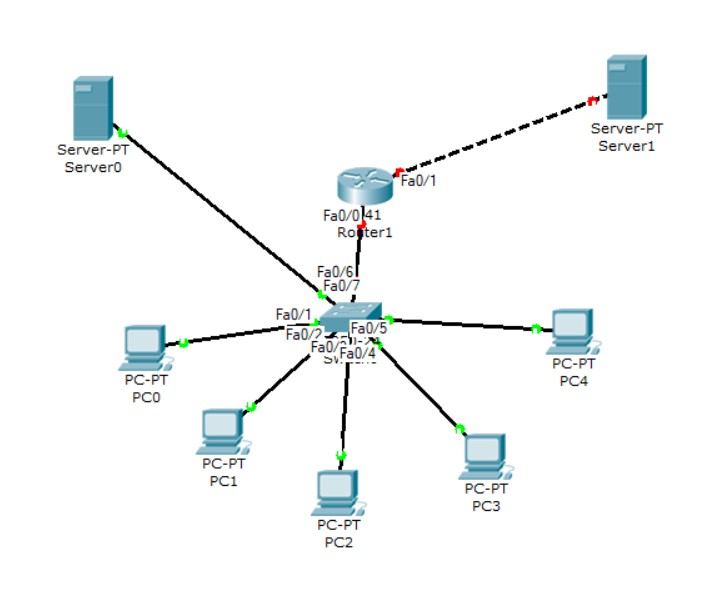

# Steps of Task4.3 execution.

The schema of network is: 5 hosts PC0- PC4, 1 server computer connected to a switch.
The switch is connected to a router. The router has also one more connection with an aside server computer.
Please see below.

Then the infrastructure was assigned with the following IPs:
- 5 computers connected to the switch: 192.168.0.1 - 192.168.0.5 respectively
- the computer server connected to the switch: 192.168.0.6
- the router was assigned with 192.168.0.100 IP. Also the password was set in the config file.
- the computer server which stands aside, behind the router, was assigned with IP 192.168.1.1.
The mask for all the above IPs is 255.255.255.0.

To check the proper operation of all infrastructure I used *Add simple PDU* tool to test the packets delivery.

The network operates properly.