# Steps of Task5.1 execution.

I changed the password of my user with *passwd* command.
It changed /etc/passwd file

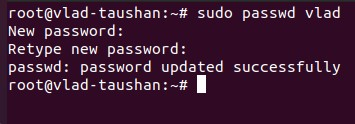

If we perform a *cat* command on /etc/passwd, we can see all the users registered in the system.
Some of them are determined to perform system operations without any output to /bin/bash to be secure.
The others are for personal usage with /bin/bash access.

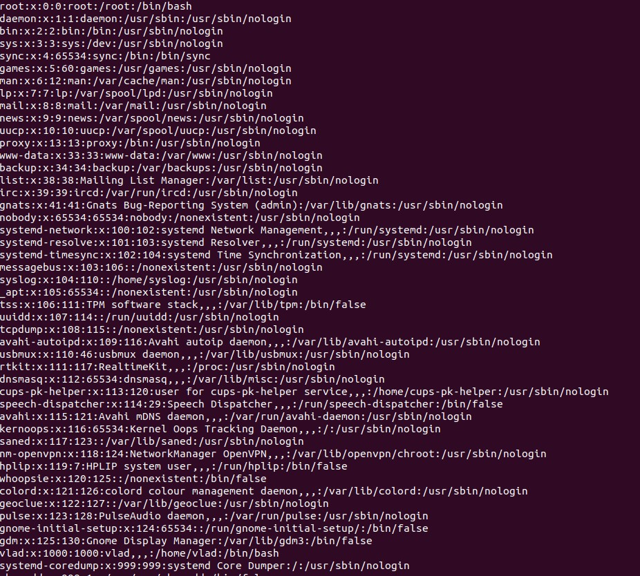

The *chfn* command changes user fullname, office room number, office phone number, and home phone number information for a user's account.
If none of the options are selected, *chfn* operates in an interactive fashion, prompting the user with the current values for all of the fields.

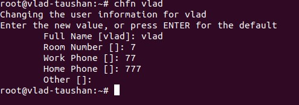

*Man* and *info* commands are the helpers while exploring different Linux commands.
All the options can be found when looking up a reference information on *passwd* command.
For instance, *-d, --delete* to delete users's password or *-h, --help* to display help message.

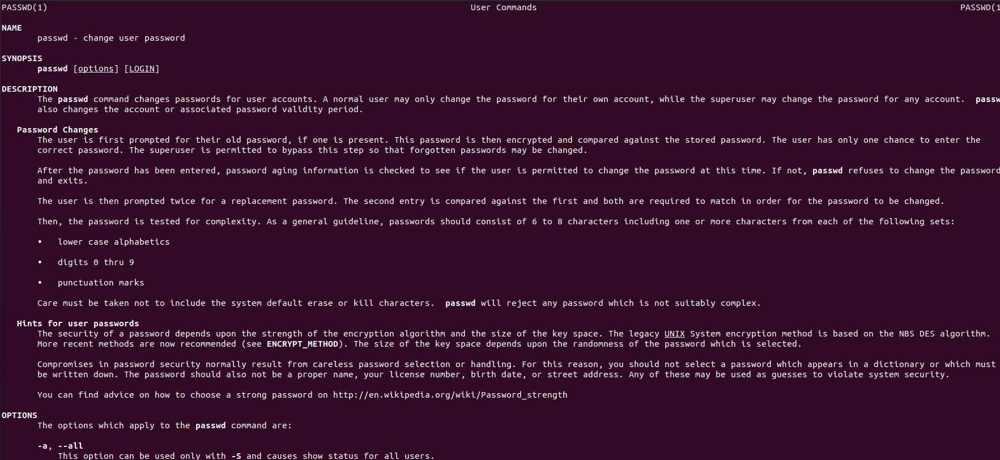

Similar to more, less command allows you to view the contents of a file and navigate through file. 
The main difference between more and less is that less command is faster because it does not load the entire file at once and allows navigation though file using page up/down keys.
Let's explore /etc/bash.bashrc file.

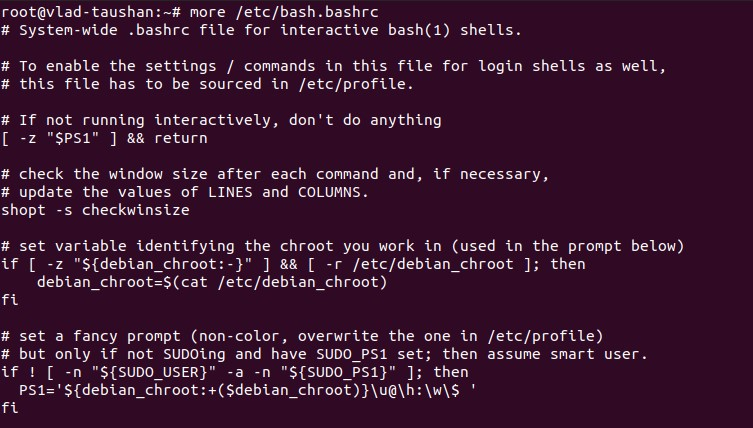

Then I installed a *finger* command and added some plans to my *.plan* file.

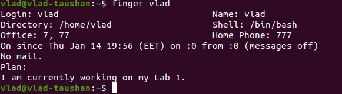

The *ls* command is more informative once used with some options, *-la*, for instance.

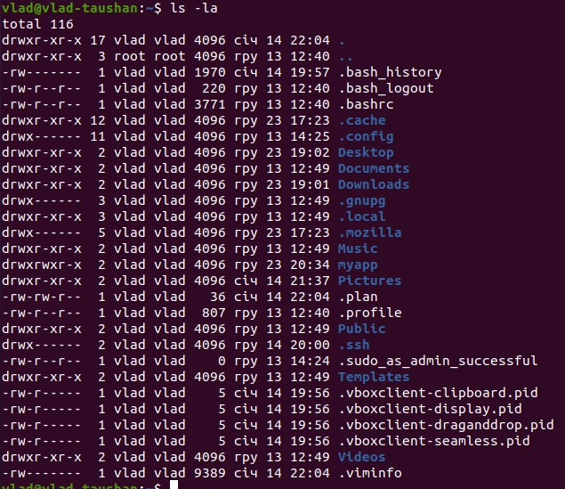

The *tree* command prints out a tree-shaped output of directories and files.
There is an option '-P', which sets the pattern for finding files.
I tried to find all files which begin with `Screenshot` part.

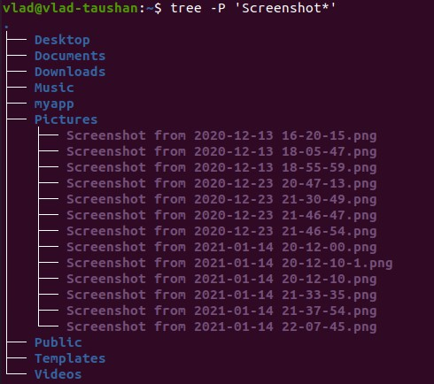

To list subdirectories of the root directory up to and including the second nesting level I used *L -2* option.

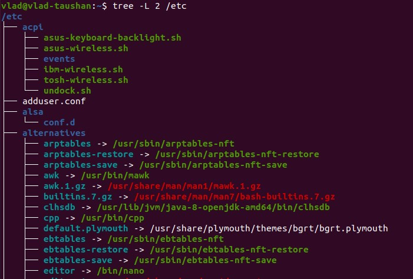

To determine the file type in Linux, we can use the *file* command. This command runs three sets of tests: the filesystem test, magic number test, and language test.

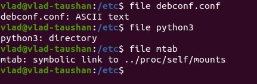

I have compared absolute and relative paths.
Regarding the return to the home directory, I have thought of at least three ways of doing this.
Please see below.

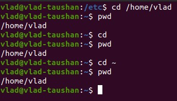

There multiple options which one can use with *ls* command.
For instance an -i option will show the inode of each file listed.
However, the most popular combination remains -la. Using it, one can see all hidden files and the explore the rights assigned.

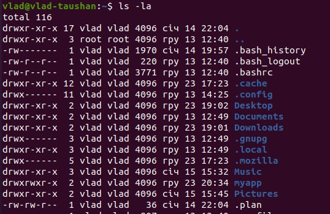

In my Home directory i created the subdirectory called Reference.
Then I created a file containing information about directories located in the root directory (using I/O redirection operations).

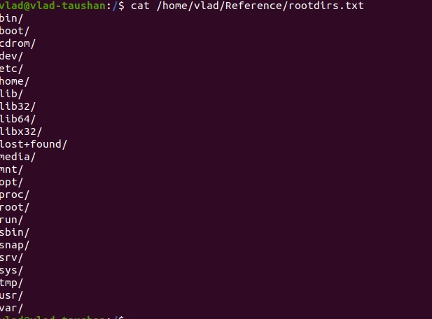

Then I created file to my home directory using relative addressing.

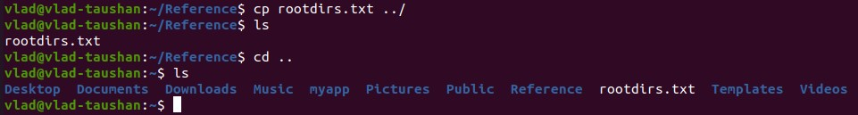

Then I removed the subdirectory, however, using *rm -rvi* option to confirm the removal of each element.

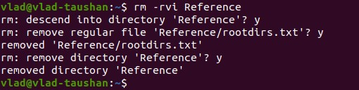

Then I deleted the file copied to the home directory.

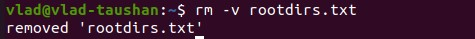

Then I copied the .bash_history file to this directory while changing its name to labwork2.

I created a hard and a soft link to the labwork2 file in the test subdirectory.
A symbolic or soft link is an actual link to the original file, whereas a hard link is a mirror copy of the original file. 
If you delete the original file, the soft link has no value, because it points to a non-existent file. 
But in the case of hard link, it is entirely opposite.

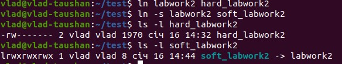

If we change the data by opening a symbolic link, the symbolic link won't ba changed anyway, only the file where it points to.

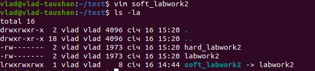

Then I renamed the hard link file to hard_lnk_labwork2 and the soft link file to symb_lnk_labwork2 file.

Upon deleting the labwork2, the soft link didn't show the content, however, the hard link did.
Actually the hard link is the exact copy of a file while the soft link performs only the function of redirection.

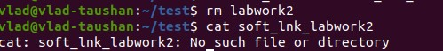

Using the locate utility, I folund all files that contain the squid and traceroute sequence.

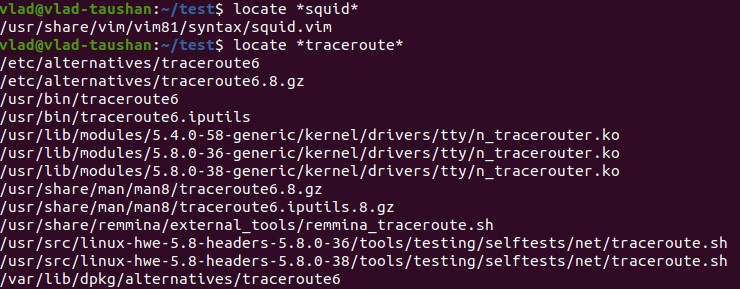

To determine which partitions are mounted in the system, as well as the types of these partitions, there are commands *mount* or *df -aTh*

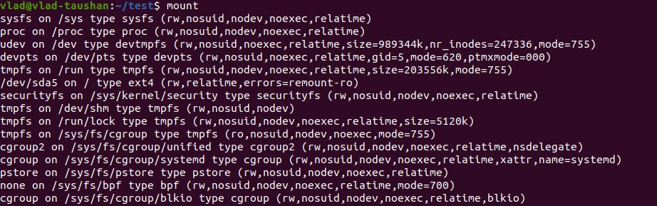

Using the *find* command, I found all files in the /etc directory containing the host character sequence.

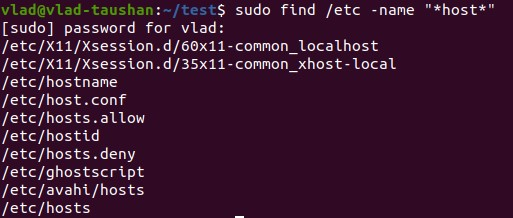

Then I listed all objects in /etc that contain the ss character sequence via *find* command.
I also get almost the same result in a little another representation via *ls | grep* commands.
Please see below.

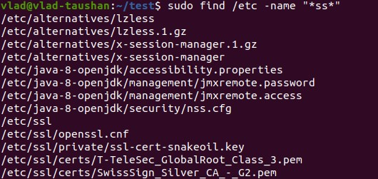

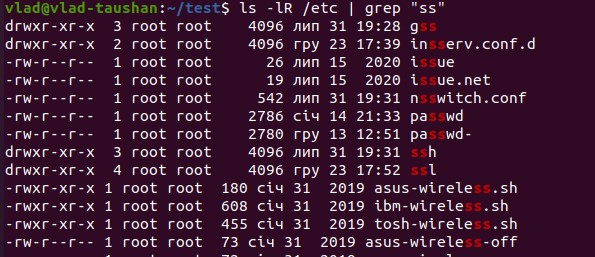

To organize a screen-by-screen print of the contents of the /etc directory, I used *ls /etc | less* and pressed a space button to move to a new screen.

When perfoming *ls -l /dev*, you can learn the device's type by the first letter in a file's row. Below there is a classification.
Block device('b')
Character device('c')
Named pipe device('p')
Socket device('s')

When perfoming *ls -l*, you can learn the file's type by the first letter in a file's row. Below there is a classification.
Regular file ('-')
Directory file ('d')
Block file('b')
Character device file('c')
Named pipe file or just a pipe file('p')
Symbolic link file('l')
Socket file('s')

Finally, to list the first 5 directory files that were recently accessed in the /etc directory, I put *ls -ltu /etc | head -6*

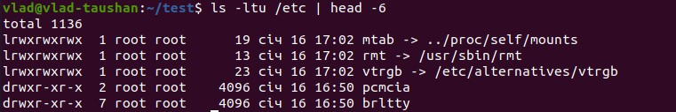

