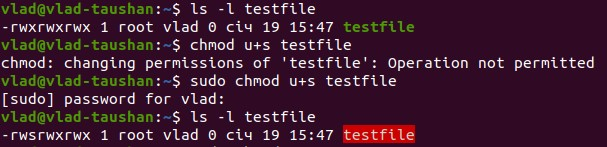

# Steps of Task5.1 execution.

1-4. /etc/passwd file stores essential information, which required during login. In other words, it stores user account information.
The structure is:
Username: It is used when user logs in. It should be between 1 and 32 characters in length.
Password: An x character indicates that encrypted password is stored in /etc/shadow file. Please note that you need to use the passwd command to computes the hash of a password typed at the CLI or to store/update the hash of the password in /etc/shadow file.
User ID (UID): Each user must be assigned a user ID (UID). UID 0 (zero) is reserved for root and UIDs 1-99 are reserved for other predefined accounts. Further UID 100-999 are reserved by system for administrative and system accounts/groups.
Group ID (GID): The primary group ID (stored in /etc/group file)
User ID Info: The comment field. It allow you to add extra information about the users such as user’s full name, phone number etc. This field use by finger command.
Home directory: The absolute path to the directory the user will be in when they log in. If this directory does not exists then users directory becomes /
Command/shell: The absolute path of a command or shell (/bin/bash). Typically, this is a shell. Please note that it does not have to be a shell. For example, sysadmin can use the nologin shell, which acts as a replacement shell for the user accounts. If shell set to /sbin/nologin and the user tries to log in to the Linux system directly, the /sbin/nologin shell closes the connection.
Here both typical users and pseud0-users can be found.
Pseudo-users are those which execute sustem commands, by default for security purposes they are also deprived of shell access.
Some pseudo-users are listed below, they are characterized by UID below 1000. The canonical users are above 1000 value.

The /etc/group is a text file which defines the groups to which users belong under Linux and UNIX operating system.
The structure is:
Group_name: It is the name of group. If you run ls -l command, you will see this name printed in the group field.
Password: Generally password is not used, hence it is empty/blank. It can store encrypted password. This is useful to implement privileged groups.
Group ID (GID): Each user must be assigned a group ID. You can see this number in your /etc/passwd file.
Group List: It is a list of user names of users who are members of the group. The user names, must be separated by commas.

To determine the groups a user belongs to, I execute the command *groups {username}*

5. There are 2 possible commands which let us create a user: *useradd* and *adduser*.
*useradd* is native binary compiled with the system. But, *adduser* is a perl script which uses useradd binary in back-end.
*adduser* is more user friendly and interactive than its back-end *useradd*.
With adduser the system level users account when created puts a user directory in home for the system user where useradd does not automatically.
While creating a user we can use different parameters to create a user with Different Home Directory, Specific User ID, Specific Group ID, Multiple Groups, without Home Directory, with Account Expiry Date, with Password Expiry Date, with Custom Comments, Change User Login Shell, etc. 

6. *usermod -l login-name old-name*
We use the usermod command in Linux to rename user account. The name of the user will be changed from the old-name to login_name. Nothing else is changed. In particular, the user’s home directory name should probably be changed to reflect the new login name.

7. *skel* is derived from the skeleton because it contains basic structure of home directory
The /etc/skel directory contains files and directories that are automatically copied over to a new user’s when it is created from useradd command.
This will ensure that all the users gets same intial settings and environment.

8. You need to use the userdel command to delete a user account and related files from user account under Linux operating system. The userdel command must be run as root user on Linux
The syntax is as follows to remove a user account on Linux.
*userdel userName*

9. The passwd command is one of the frequently used command by Linux administrator very often to update user’s authentication tokens in the /etc/shadow file.
Run the passwd command with the *-l* switch to lock the given user account *passwd -l user*
Run the passwd command with the *-u* switch to unlock the given user account *passwd -u user*

10. All user passwords are stored in /etc/shadow file. The quick way to remove/delete a user password is pass *--delete* option to the *passwd* command.
Above command delete a user’s password (make it empty). This is a quick way to disable a password for an account. It will set the named account passwordless. User will not able to login. 
It is also a good idea to setup user shell to nologin to avoid security related problems:
*usermod -s /usr/sbin/nologin username*

11. To display the extended format of information about the directory, use *list -d -l*'
The displayed fileds are:
File type: First field in the output is file type. If the there is a *d* it means it is a directory.
Link count
Owner: This field provide info about the creator of the directory.
Group: This filed provide info about who all can access the directory.
File size: This field provide info about the file size. By default the ls -l command give output in bytes.
Date: date and time of the latest modification

12. On a Linux system, each file and directory is assigned access rights for the owner of the file, the members of a group of related users, and everybody else. Rights can be assigned to read a file, to write a file, and to execute a file (i.e., run the file as a program).
To see the permission settings for a file, we can use the *ls -l* command.
Each file or directory has three basic permission types:

read – The Read permission refers to a user’s capability to read the contents of the file.
write – The Write permissions refer to a user’s capability to write or modify a file or directory.
execute – The Execute permission affects a user’s capability to execute a file or view the contents of a directory.

13. The concept of Linux File permission and ownership is crucial in Linux.
To check the file's creator (user), permissions and therefore user connaction with the file, type *ls -la*

14. For changing the ownership of a file/directory, you can use the following command: *chown user*
In case you want to change the user as well as group for a file or directory use the command: *chown user:group filename*.
We can use the 'chmod' command which stands for 'change mode'. Using the command, we can set permissions (read, write, execute) on a file/directory for the owner, group and the world. Syntax: *chmod permissions filename*

15. To set the permission using binary references you must first understand that the input is done by entering three integers/numbers.
The first number represents the Owner permission; the second represents the Group permissions; and the last number represents the permissions for all other users. The numbers are a binary representation of the rwx string.
r = 4
w = 2
x = 1

When user create a file or directory under Linux or UNIX, he/she creates it with a default set of permissions. 
In most case the system defaults may be open or relaxed for file sharing purpose.
The user file-creation mode mask (umask) is used to determine the file permission for newly created files. 
It can be used to control the default file permission for new files. It is a four-digit octal number. A umask can be set or expressed using:
Symbolic values
Octal values
You can setup umask in /etc/bashrc or /etc/profile file for all users. By default most Linux distro set it to 0022 (022) or 0002 (002). Open /etc/profile or ~/.bashrc file, enter:
vi /etc/profile OR vi ~/.bashrc
Append/modify following line to setup a new umask:
umask 022

The octal umasks are calculated via the bitwise AND of the unary complement of the argument using bitwise NOT. The octal notations are as follows:
Octal value : Permission
0 : read, write and execute
1 : read and write
2 : read and execute
3 : read only
4 : write and execute
5 : write only
6 : execute only
7 : no permissions

16. The sticky bit was initially introduced to ‘stick’ an executable program’s text segment in the swap space even after the program has completed execution, to speed up the subsequent runs of the same program. However, these days the sticky bit means something entirely different.
When a directory has the sticky bit set, its files can be deleted or renamed only by the file owner, directory owner and the root user. The command below shows how the sticky bit can be set.
*chmod +t*
Simply look for a ‘t’ character in the file permissions to locate the sticky bit.
There are also setiud and setguid options when speaking about identifier substitution.
The *setuid bit* is present for files which have executable permissions. The setuid bit simply indicates that when running the executable, it will set its permissions to that of the user who created it (owner), instead of setting it to the user who launched it. 
Similarly, there is a setgid bit which does the same for the gid.
To locate the setuid, look for an ‘s’ instead of an ‘x’ in the executable bit of the file permissions.
To set the setuid bit, use the following command *chmod u+s*
The *setgid* affects both files as well as directories. When used on a file, it executes with the privileges of the group of the user who owns it instead of executing with those of the group of the user who executed it.
When the bit is set for a directory, the set of files in that directory will have the same group as the group of the parent directory, and not that of the user who created those files. This is used for file sharing since they can be now modified by all the users who are part of the group of the parent directory.

17. A script file should have an execution permission or *x* attribute to be executable.
When composing the script itself, there is a row of different attribites whcih can be used to check some condition.
Some examples are listed below:
*-g file*
True if file exists and is set-group-id.
*-h file*
True if file exists and is a symbolic link.
*-k file*
True if file exists and its ‘‘sticky’’ bit is set.
*-p file*
True if file exists and is a named pipe (FIFO).